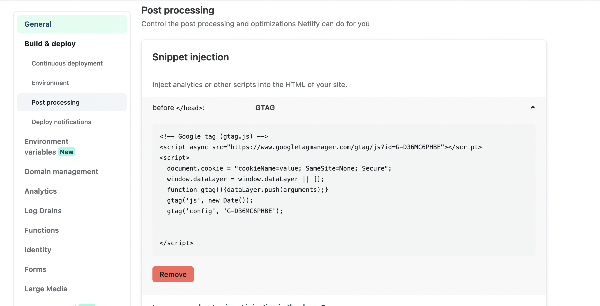
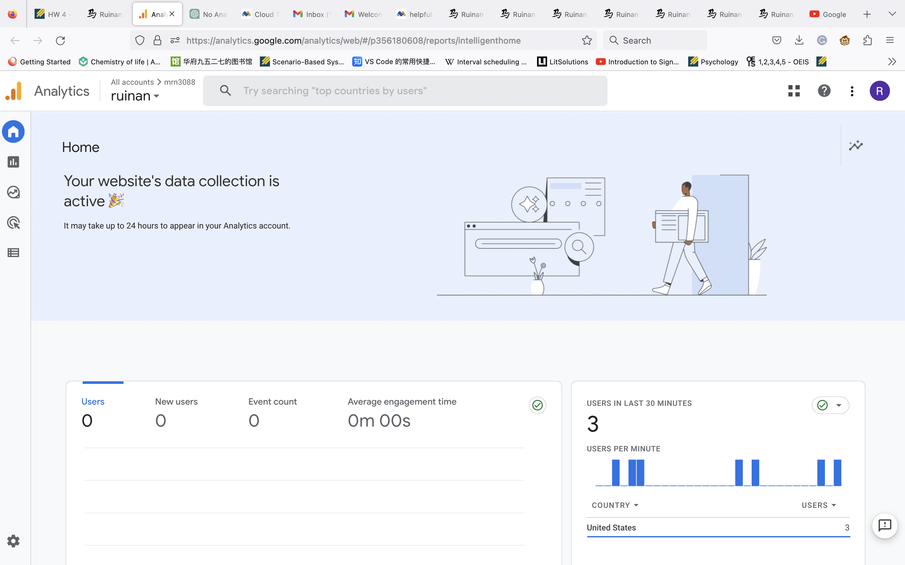

# Changelog

## Part 5 - 1

* I added a hamburger menu for the mobile screen. Javascript was used to add transformation/translation to control the mobile nav bar in this case. This takes up most efforts. (On a labtop, please narror the brower to see the effect).
* I also changed the photos so three different size of photos could be loaded from the media query. jpeg and webp are used. 

## Part 5 - 2

* I used Google Analytics to analyze my website. I added the code snippet proved by Google Analytics to my page (See screenshot below).

